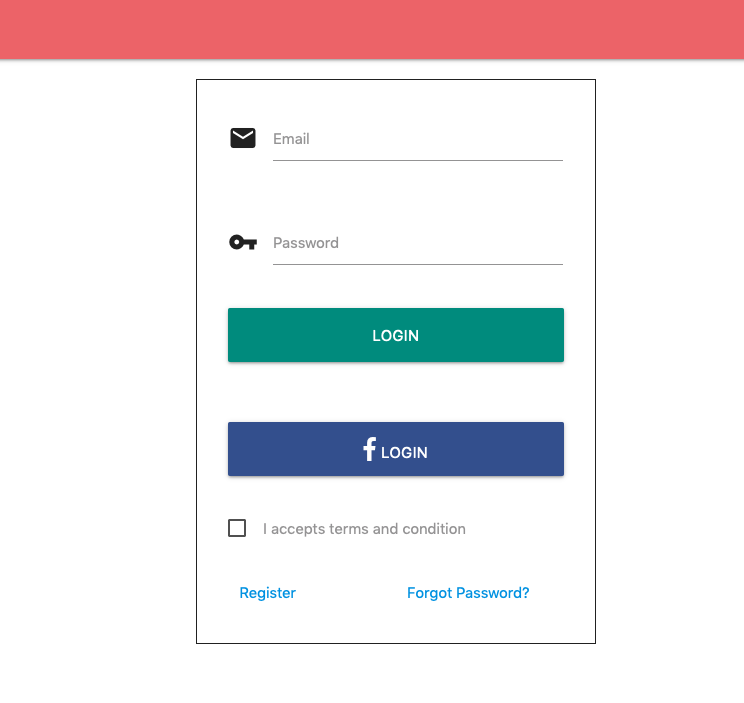
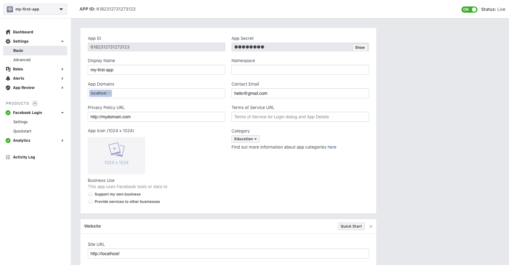

# django-auth-with-social
This repository is  an example of django authentication with Social Provider using [django-allauth](https://django-allauth.readthedocs.io/en/latest/index.html)




Currently Supported Social Provider
- Facebook


# Installation 
```bash
$ git clone git@github.com:bkawan/django-auth-with-social.git
$ cd django-auth-with-social
$ pipenv install
$ python manage.py migrate
$ python manage.py createsuperuser
$ python manage.py runserver

```

**Using https in localhost**
```
$ python manage.py runserver_plus --cert /tmp/cert
```


# Configuration

visit your admin pages (e.g. http://localhost:8000/admin/) and follow these steps:

- Add a Site for your domain, matching settings.SITE_ID (django.contrib.sites app).
- For each OAuth based provider, add a Social App (socialaccount app).
- Fill in the site and the OAuth app credentials obtained from the provider.

Go to https://localhost:8000/admin/socialaccount/socialapp/add/

Then Fill the following 

- Provider
- Name
- Client Id
- Secret Key


### IF you do not know how to get ```client id``` and ```secret key```  from the different social provider follow the steps below.

#### Facebook

To get app_key and secret_key

- login to facebook or directly to go 
https://developers.facebook.com

- Create New App 
- Open newly created here ```my-first-app```
- Set configuration as below 




- Then Grab ```App ID ``` and ```App Secret```

